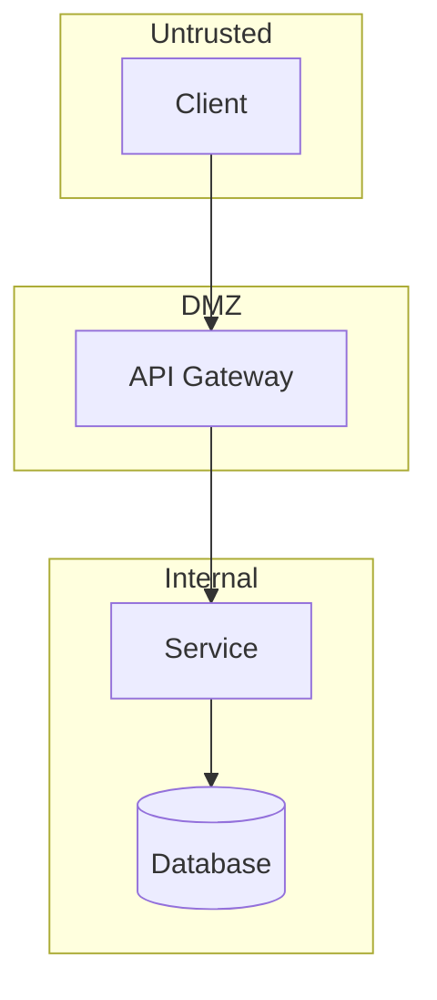

# STRIDE Threat Model Generator

Generate a comprehensive STRIDE threat model for the specified system or component.

## Process

### Step 1: System Analysis
1. Identify all components
2. Map data flows
3. Identify entry points (APIs, webhooks, file uploads)
4. Mark trust boundaries

### Step 2: Architecture Diagram
Create a Mermaid flowchart showing:
- Components as nodes
- Data flows as arrows
- Trust boundaries as subgraphs



### Step 3: STRIDE Analysis

For each component/data flow, analyze:

**S - Spoofing Identity**
- Can an attacker impersonate users or services?
- Threats: Credential theft, session hijacking, JWT forgery

**T - Tampering**
- Can data be modified maliciously?
- Threats: SQL injection, parameter tampering, file modification

**R - Repudiation**
- Can users deny actions?
- Threats: Missing audit logs, unsigned transactions

**I - Information Disclosure**
- Can sensitive data leak?
- Threats: Error messages, logs, IDOR, path traversal

**D - Denial of Service**
- Can the system be made unavailable?
- Threats: Resource exhaustion, login flooding

**E - Elevation of Privilege**
- Can users gain unauthorized access?
- Threats: Role escalation, SSRF to internal services

### Step 4: Prioritization
Rate each threat:
- **Impact**: Critical/High/Medium/Low
- **Likelihood**: High/Medium/Low
- **Mitigation Status**: Implemented/Partial/Missing

## Output Template

Use the template from `threat-models/templates/stride-template.md`:

```markdown
# STRIDE Threat Model: [System Name]

## System Overview
**Author:** [Name]
**Date:** [Date]
**Version:** 1.0

### Description
[Brief description]

### Architecture Diagram
[Mermaid diagram]

### Components
1. [Component 1]
2. [Component 2]

### Trust Boundaries
1. [Boundary 1]: [What data crosses]
2. [Boundary 2]: [What data crosses]

---

## STRIDE Analysis

### Spoofing
| ID | Threat | Impact | Likelihood | Mitigation | Status |
|----|--------|--------|------------|------------|--------|
| S1 | [Threat] | High | Medium | [Mitigation] | ❌ Missing |

### Tampering
[Same format]

### Repudiation
[Same format]

### Information Disclosure
[Same format]

### Denial of Service
[Same format]

### Elevation of Privilege
[Same format]

---

## Priority Threats

### Critical
1. **[ID]**: [Description] - [Why critical]

### High
1. **[ID]**: [Description]

---

## Recommended Mitigations

| Priority | Threat | Mitigation | Effort | Owner |
|----------|--------|------------|--------|-------|
| 1 | [ID] | [Action] | [Est.] | [Team] |
```

Reference the completed example at `threat-models/examples/auth-payment-system-threat-model.md` for guidance.

Generate the threat model now. Be thorough in identifying threats - assume an adversarial perspective.
