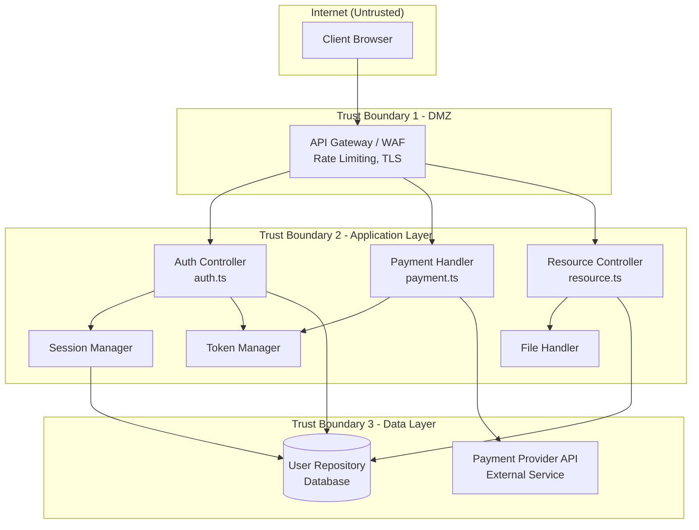

# STRIDE Threat Model: Authentication & Payment System

## System Overview

**System Name:** Secure Payment Platform
**Version:** 1.0
**Author:** Security Team
**Date:** 2024

### Description
A web-based payment platform with user authentication, payment processing, and transaction management. This threat model covers the same system analyzed in Lab 1 vulnerable code.

### Architecture Diagram

### Components
1. **Auth Controller** - User login, registration, password management
2. **Payment Handler** - Payment processing, refunds, webhooks
3. **Resource Controller** - File access, external resource fetching
4. **Session Manager** - Session creation, validation, invalidation
5. **Token Manager** - JWT creation and verification
6. **User Repository** - Database operations
7. **File Handler** - File upload/download operations

### Data Flows
| From | To | Data Type | Protocol |
|------|-----|-----------|----------|
| Client | API Gateway | Credentials | HTTPS |
| Auth Controller | Session Manager | User ID | Internal |
| Auth Controller | User Repository | User Data | SQL/TLS |
| Payment Handler | Payment Provider | Card Token | HTTPS |
| Payment Provider | Payment Handler | Webhook | HTTPS |
| Resource Controller | External Services | URLs | HTTPS |
| File Handler | Storage | Files | Internal |

### Trust Boundaries
1. **Internet/DMZ** - Untrusted external traffic
2. **DMZ/Application** - Between gateway and services
3. **Application/Database** - Between services and data stores

---

## STRIDE Analysis

### Spoofing

| ID | Threat | Attack Vector | Impact | Likelihood | Mitigation |
|----|--------|---------------|--------|------------|------------|
| S1 | Session Hijacking | Steal session token via XSS or network sniffing | Attacker impersonates legitimate user | High | httpOnly + Secure cookies, TLS everywhere |
| S2 | Credential Theft | Brute force login, credential stuffing | Account takeover | High | Rate limiting, account lockout, MFA |
| S3 | Token Forgery | Weak JWT secret or 'none' algorithm | Create valid tokens without credentials | Medium | Strong secret, algorithm validation |
| S4 | Webhook Spoofing | Forge payment webhooks | Trigger fraudulent transactions | Medium | HMAC signature verification |

### Tampering

| ID | Threat | Attack Vector | Impact | Likelihood | Mitigation |
|----|--------|---------------|--------|------------|------------|
| T1 | SQL Injection | Malicious input in queries | Modify/delete database records | High | Parameterized queries |
| T2 | Mass Assignment | Include role in update request | Escalate to admin privileges | Medium | Whitelist allowed fields |
| T3 | Payment Amount | Negative or modified amounts | Financial loss, credits | Medium | Server-side validation |
| T4 | Token Payload | Modify JWT claims | Change role or permissions | Low | Signature verification |

### Repudiation

| ID | Threat | Attack Vector | Impact | Likelihood | Mitigation |
|----|--------|---------------|--------|------------|------------|
| R1 | Deny Transaction | User disputes legitimate payment | Chargeback costs | Medium | Comprehensive audit logging |
| R2 | Admin Actions | Admin denies security changes | Cannot investigate incidents | Low | Tamper-proof audit logs |
| R3 | Failed Login Denial | Attacker claims account was compromised | Account recovery abuse | Medium | Log all auth events with IP/device |

### Information Disclosure

| ID | Threat | Attack Vector | Impact | Likelihood | Mitigation |
|----|--------|---------------|--------|------------|------------|
| I1 | Password Exposure | Passwords logged or in response | Credential theft | Critical | Never log/return passwords |
| I2 | Card Number Exposure | Full PAN in logs or storage | PCI violation, fraud | Critical | Tokenization, mask in logs |
| I3 | User Enumeration | Different error messages | Discover valid accounts | Medium | Generic error messages |
| I4 | Stack Trace Exposure | Verbose errors to client | Internal architecture revealed | Medium | Generic errors, log internally |
| I5 | IDOR | Access other users' data | Privacy breach | High | Authorization checks |

### Denial of Service

| ID | Threat | Attack Vector | Impact | Likelihood | Mitigation |
|----|--------|---------------|--------|------------|------------|
| D1 | Login Flooding | Rapid login attempts | Account lockout, service degradation | High | Rate limiting, CAPTCHA |
| D2 | Payment Spam | Flood payment endpoint | Transaction processing delays | Medium | Rate limiting, fraud detection |
| D3 | Resource Exhaustion | Large file uploads | Storage/memory exhaustion | Medium | File size limits |
| D4 | ReDoS | Malicious regex input | CPU exhaustion | Low | Safe regex patterns |

### Elevation of Privilege

| ID | Threat | Attack Vector | Impact | Likelihood | Mitigation |
|----|--------|---------------|--------|------------|------------|
| E1 | Role Escalation | Mass assignment to set admin role | Full system access | High | Whitelist update fields |
| E2 | IDOR to Admin | Access admin endpoints via ID guessing | Administrative actions | Medium | Role-based access control |
| E3 | JWT Algorithm Confusion | Switch RS256 to HS256 | Forge admin tokens | Medium | Explicit algorithm validation |
| E4 | SSRF to Internal | Access internal admin services | Internal system compromise | High | URL allowlist, block internal IPs |

---

## Priority Threats

### Critical (Immediate Action)
1. **I1** - Password Exposure: Passwords in logs/responses
2. **I2** - Card Number Exposure: PCI violation
3. **T1** - SQL Injection: Database compromise
4. **E4** - SSRF: Internal network access

### High (This Sprint)
1. **S2** - Credential Theft: Missing rate limiting
2. **E1** - Role Escalation: Mass assignment
3. **I5** - IDOR: Missing authorization checks
4. **S1** - Session Hijacking: Insecure cookies

### Medium (Next Sprint)
1. **T3** - Payment Amount Tampering
2. **S4** - Webhook Spoofing
3. **I3** - User Enumeration
4. **R1** - Transaction Repudiation

---

## Recommended Mitigations

| Priority | Threat | Mitigation | Implementation | Owner |
|----------|--------|------------|----------------|-------|
| 1 | I1, I2 | Remove sensitive data from logs | Update logging config | DevOps |
| 2 | T1 | Parameterized queries | Refactor user-repository.ts | Backend |
| 3 | S2, D1 | Rate limiting | Add express-rate-limit | Backend |
| 4 | E1, T2 | Field whitelisting | Update auth-controller.ts | Backend |
| 5 | I5, E2 | Authorization middleware | Add authz checks | Backend |
| 6 | E4 | SSRF protection | URL allowlist | Backend |
| 7 | S1 | Secure cookies | Add httpOnly, Secure, SameSite | Backend |
| 8 | S3, E3 | JWT hardening | Algorithm validation | Backend |
| 9 | S4 | Webhook signatures | HMAC verification | Backend |
| 10 | R1, R2 | Audit logging | Structured security logs | DevOps |

---

## Security Controls Summary

| Control | Status | Location |
|---------|--------|----------|
| Password Hashing | ❌ Missing | auth-controller.ts |
| Rate Limiting | ❌ Missing | API layer |
| Authorization | ❌ Missing | All controllers |
| Input Validation | ❌ Missing | All endpoints |
| Parameterized Queries | ❌ Missing | user-repository.ts |
| Secure Sessions | ❌ Missing | session-manager.ts |
| JWT Validation | ❌ Missing | token-manager.ts |
| SSRF Protection | ❌ Missing | resource-controller.ts |
| Webhook Signatures | ❌ Missing | payment-handler.ts |
| Security Logging | ❌ Missing | All components |

**Overall Risk Level: CRITICAL**

All 10 security controls are missing or inadequate in the vulnerable codebase.
