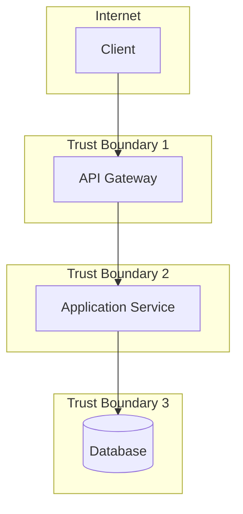

# STRIDE Threat Model Template

## System Overview

**System Name:** [Name]
**Version:** [Version]
**Author:** [Your Name]
**Date:** [Date]

### Description
[Brief description of the system]

### Architecture Diagram

### Components
1. [Component 1]
2. [Component 2]
3. [Component 3]

### Data Flows
| From | To | Data Type | Protocol |
|------|-----|-----------|----------|
| | | | |

### Trust Boundaries
1. [Boundary 1]
2. [Boundary 2]

---

## STRIDE Analysis

### Spoofing

| ID | Threat | Vector | Impact | Likelihood | Mitigation |
|----|--------|--------|--------|------------|------------|
| S1 | | | | | |
| S2 | | | | | |

### Tampering

| ID | Threat | Vector | Impact | Likelihood | Mitigation |
|----|--------|--------|--------|------------|------------|
| T1 | | | | | |
| T2 | | | | | |

### Repudiation

| ID | Threat | Vector | Impact | Likelihood | Mitigation |
|----|--------|--------|--------|------------|------------|
| R1 | | | | | |
| R2 | | | | | |

### Information Disclosure

| ID | Threat | Vector | Impact | Likelihood | Mitigation |
|----|--------|--------|--------|------------|------------|
| I1 | | | | | |
| I2 | | | | | |

### Denial of Service

| ID | Threat | Vector | Impact | Likelihood | Mitigation |
|----|--------|--------|--------|------------|------------|
| D1 | | | | | |
| D2 | | | | | |

### Elevation of Privilege

| ID | Threat | Vector | Impact | Likelihood | Mitigation |
|----|--------|--------|--------|------------|------------|
| E1 | | | | | |
| E2 | | | | | |

---

## Priority Threats

### Critical
1. [Threat ID]: [Description]

### High
1. [Threat ID]: [Description]

### Medium
1. [Threat ID]: [Description]

---

## Recommended Mitigations

| Priority | Threat | Mitigation | Owner | Due Date |
|----------|--------|------------|-------|----------|
| 1 | | | | |
| 2 | | | | |
| 3 | | | | |
